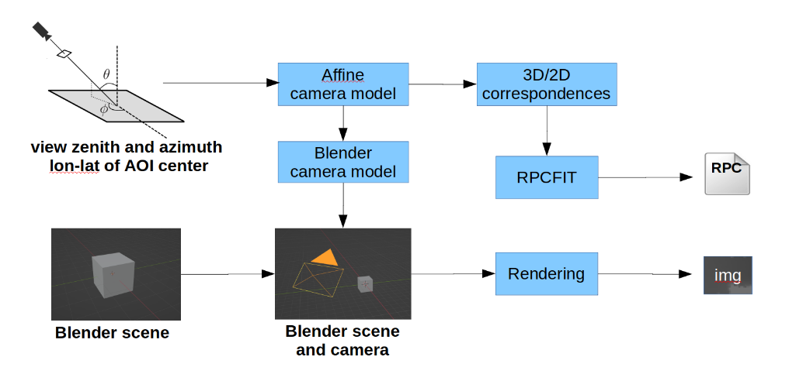
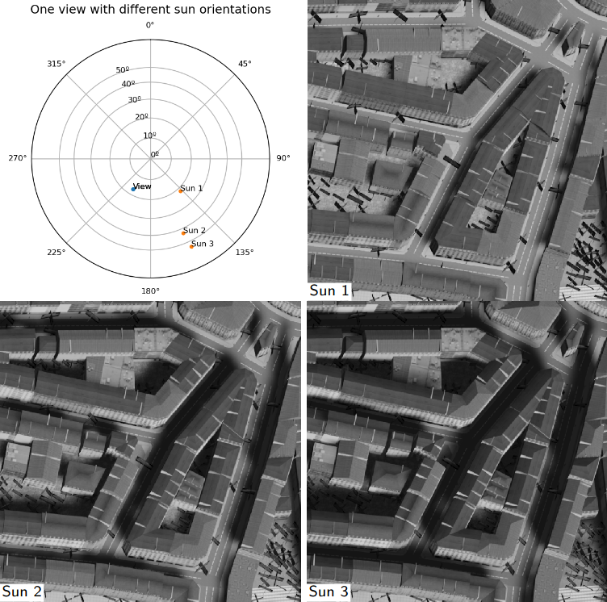
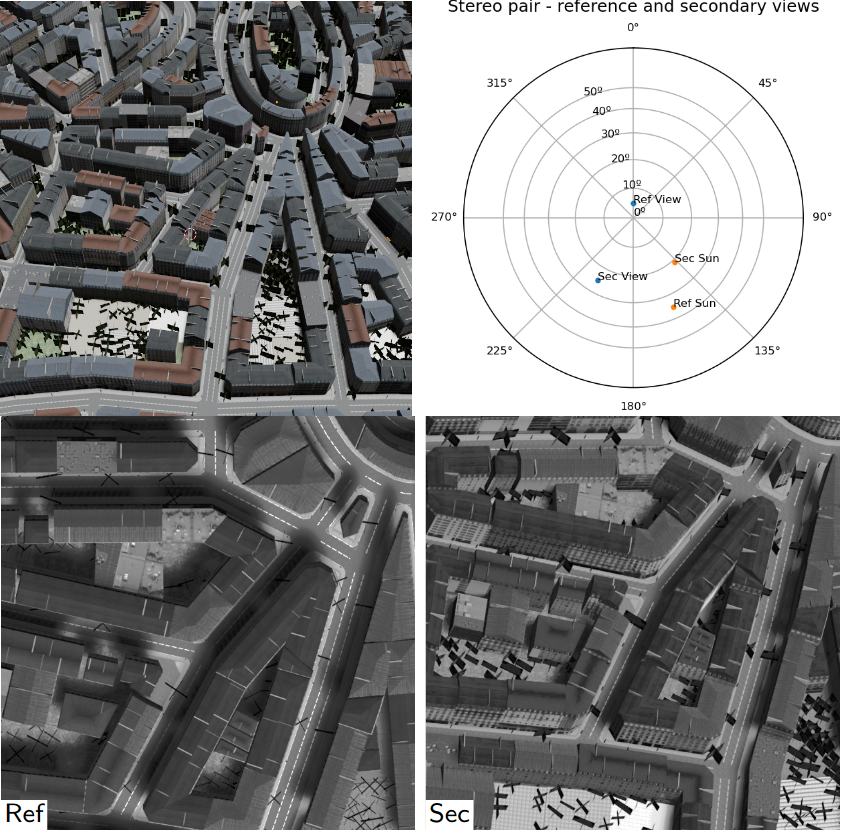

# Simsatool: Image+RPC generation from a 3D scene

`Simsatool` is a python module for the generation of image-rpc pairs apt to be used in a satellite pipeline.

The development of the tool started as part of the work presented to WACV 2023:

Alvaro Gomez, Gabriele Facciolo, Rafael Grompone von Gioi and Gregory Randall. 
“Improving the Pair Selection and the Model Fusion Steps of Satellite Multi-View Stereo Pipelines.” In Proceedings of the IEEE/CVF Winter Conference on Applications of Computer Vision, 2023

[bibtex](#How-to-cite)


## Overview
---



---

Given a scene and a view orientation, an affine camera model is determined. 
The affine camera model is a sensible approximation of a real satellite projection for a small area of interest (AOI). This  model gives corresponding 3D/2D coordinates between the volume of interest (AOI plus height range) and the image. The correspondences are then used to adjust an RPC camera model using the 
[RPCFIT](https://github.com/centreborelli/rpcfit) tool 
which fits an RPC model to the 3D/2D correspondences through a regularized least squares minimization. The simulator uses [Blender](https://www.blender.org/)  as the 3D engine to render the views. Blender is launched and configured automatically through Python scripts. 

The tool can also generate configurations to run a stereo reconstruction with the [S2P](https://github.com/centreborelli/s2p) pipeline on a simulated pair. 

***
## Requirements

### rpcfit
The module uses this python package [rpcfit](https://github.com/centreborelli/rpcfit) to generate an RPC file from 3D-2D correspondences

### ponomarenko
The module uses this python package [ponomarenko](https://github.com/centreborelli/ponomarenko/tree/master/ponomarenko) to estimate the noise of an image

### Blender

The rendering of the views is done using Blender. An instalation of [Blender](https://www.blender.org/) version >= 2.8 is neccesary. The `blender` command should be available to be called in command line mode.

### S2P (optional)

The tool can generate configurations to run stereo reconstructions with the S2P pipeline. If you want to use this feature please install [S2P](https://github.com/centreborelli/s2p)  

***
## Usage examples

Two usage examples are provided with the code. The **data** folder contains the datasets that are used for the examples. 

The orientation of a view and the location of the sun are expressed both in terms of azimuth and zenith angles in degrees. Azimuth angle is the number of degrees rotating east from north. The azimuth can be expressed as a positive number of degrees ranging from 0 to 360 where 0º corresponds to north, 90º to east and so forth.
Zenith angle is the number of degrees down from the vertical direction. The zenith is expressed as a positive number of degrees ranging from 0 to 90 where 0º corresponds to overhead and 90º to the horizon. 

### Example 1: One view with different sun orientations

The example generates three images with the same orientation and different sun positions.  



The images and corresponding RPCs are generated with the following code:  

```python
from simulator import Simulator
from satellite import Satellite
from location import Location
from blender import Blender

#%% DIRECTORIES AND FILENAMES -------------------------------
# The simulation results will be created under this directory
simulation_base_dir = 'data/SIMULATION_EXAMPLE_SUNPOS' 

# Select the 3D scene
blender_scene_filename ='data/model/city_scene.blend'

#%% VIEWS AND SUN ORIENTATION -------------------------------
# All angles are in degrees
ref_zenith_list =  [17, 17, 17]    
ref_azimuth_list = [210, 210, 210]
ref_sun_zenith_list =[21.74, 42.98, 54.23]
ref_sun_azimuth_list = [137.21, 156.32, 155.07]

#%% SETUP THE SIMULATOR  ------------------------------------
satellite = Satellite()
blender = Blender(blender_scene_filename, 
                  image_xy_size=(600,600))
location = Location()
sim = Simulator(simulation_base_dir, 
                satellite, blender, location)

#%% GENERATE THE IMAGES -------------------------------------
for i in range(len(ref_zenith_list)):
  ref_image_filename, ref_rpc_filename = \
    sim.simulate_image_and_rpcfit(ref_zenith_list[i],
                                  ref_azimuth_list[i], 
                                  None,
                                  ref_sun_zenith_list[i],
                                  ref_sun_azimuth_list[i]) 

```


### Example 2: A stereo pair to be reconstructed with S2P

The example generates a stereo pair of images and a S2P configuration for the stereo reconstruction of the pair. The values and noise in the images of the pair are approximately matched to the values and noise of a reference image.  

The following figure shows in the top row a view of the 3D scene and the orientations of the views and sun in the stereo pair. The bottom row contains the generated images.



The images and corresponding RPCs along with an S2P configuration are generated with the following code:


```python
import os
from simulator import Simulator
from satellite import Satellite
from location import Location
from blender import Blender
from s2p_configurator import S2PConfigurator

#%% DIRECTORIES AND FILENAMES -------------------------------
# The simulation results will be created under this directory
simulation_base_dir = 'data/SIMULATION_EXAMPLE_STEREO_PAIR' 

# Select the 3D scene
blender_scene_filename ='data/model/city_scene.blend'

# Each generated image can be approximately matched in values
# and noise to a different reference image.
# Here we use a single reference image for both images of the 
# pair.
target_image_filename = 'data/images/IARPA_15DEC18140510.tif'

# The configuration to run the stereo reconstruction 
# will be created under:
# <simulation_base_dir>/S2P_CONFIGS
s2p_configs_dir = os.path.join(simulation_base_dir,    
                               'S2P_CONFIGS') 

#%% VIEWS AND SUN ORIENTATION -------------------------------
# All angles are in degrees
# Generate a pair of images [(ref)erence - (sec)ondary]
ref_zenith = 5
ref_azimuth = 0
ref_sun_zenith = 35
ref_sun_azimuth = 156
# ---------------  
sec_zenith = 25
sec_azimuth = 210
sec_sun_zenith =21
sec_sun_azimuth = 137

#%% SETUP THE SIMULATOR  ------------------------------------
satellite = Satellite()
blender = Blender(blender_scene_filename, 
                  image_xy_size=(600,600))
location = Location()
sim = Simulator(simulation_base_dir, 
                satellite, blender, location)

#%% SETUP THE S2P CONFIGURATOR  -----------------------------
s2p_configurator = S2PConfigurator(s2p_configs_dir)

#%% GENERATE THE IMAGE PAIR AND S2P CONFIGURATION -----------

ref_image_filename, ref_rpc_filename = \
        sim.simulate_image_and_rpcfit(ref_zenith, 
                                      ref_azimuth, None,
                                      ref_sun_zenith, 
                                      ref_sun_azimuth,
                                      target_image_filename)
   
sec_image_filename, sec_rpc_filename = \
        sim.simulate_image_and_rpcfit(sec_zenith, 
                                      sec_azimuth, None,
                                      sec_sun_zenith, 
                                      sec_sun_azimuth,
                                      target_image_filename)

s2p_config_filename = \
        s2p_configurator.create_config(ref_image_filename, 
                                       ref_rpc_filename, 
                                       sec_image_filename, 
                                       sec_rpc_filename)    
```

## How to cite
If you find this software useful please cite:

    @inproceedings{gomez2022experimental,
      title={Improving the Pair Selection and the Model Fusion Steps of Satellite Multi-View Stereo Pipelines},
      author={Gomez, Alvaro and Facciolo, Gabriele and von Gioi, Rafael Grompone and Randall, Gregory },
      booktitle={Proceedings of the IEEE/CVF Winter Conference on Applications of Computer Vision},
      year={2023}
    }